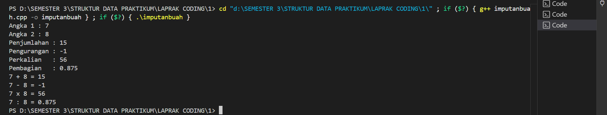
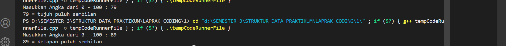
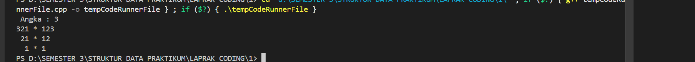

# <h1 align="center">Laporan Praktikum Modul 1 <br> Modul 1 Codeblocks IDE & Pengenalan Bahasa C++ </h1>
<p align="center">Ajda Mutiara Zahra - 103112400210</p>

## Dasar Teori
Bahasa C++ adalah bahasa pemrograman tingkat tinggi yang programnya selalu dimulai dari fungsi main() dan biasanya diawali dengan #include <iostream> untuk mendukung input dan output. Data disimpan dalam variabel dengan tipe tertentu seperti int, float, char, string, dan bool, lalu diolah menggunakan operator aritmatika, relasi, maupun logika. Untuk mengatur alur, C++ menyediakan percabangan (if-else, switch) serta perulangan (for, while, do-while) agar instruksi bisa dipilih atau diulang sesuai kondisi. Supaya lebih terstruktur, digunakan fungsi yang dapat berupa prosedur tanpa nilai balik atau fungsi yang menghasilkan nilai, serta struct yang berfungsi mengelompokkan data terkait menjadi satu kesatuan yang rapi. 

## Guided

### 1. Aritmatika
```
#include <iostream>
using namespace std;
int main()
{
    int W, X, Y;
    float Z;
    X = 7;
    Y = 3;
    W = 1;
    Z = (X + Y) / (Y + W);
    cout << "Nilai z = " << Z << endl;
    return 0;
}
```
Penjelasan Program :
Program di atas untuk melakukan perhitungan aritmatika sederhana, yaitu menjumlahkan dua bilangan lalu membaginya dengan hasil penjumlahan bilangan lain, kemudian menampilkan hasil akhirnya ke layar.

### 2. Fungsi 
```
#include <iostream>
using namespace std;

// Prosedur: hanya menampilkan hasil, tidak mengembalikan nilai
void tampilkanHasil(double p, double l)
{
    cout << "\n=== Hasil Perhitungan ===" << endl;
    cout << "Panjang : " << p << endl;
    cout << "Lebar   : " << l << endl;
    cout << "Luas    : " << p * l << endl;
    cout << "Keliling: " << 2 * (p + l) << endl;
}

// Fungsi: mengembalikan nilai luas
double hitungLuas(double p, double l)
{
    return p * l;
}

// Fungsi: mengembalikan nilai keliling
double hitungKeliling(double p, double l)
{
    return 2 * (p + l);
}

int main()
{
    double panjang, lebar;

    cout << "Masukkan panjang: ";
    cin >> panjang;
    cout << "Masukkan lebar  : ";
    cin >> lebar;

    // Panggil fungsi
    double luas = hitungLuas(panjang, lebar);
    double keliling = hitungKeliling(panjang, lebar);

    cout << "\nDihitung dengan fungsi:" << endl;
    cout << "Luas      = " << luas << endl;
    cout << "Keliling  = " << keliling << endl;

    // Panggil prosedur
    tampilkanHasil(panjang, lebar);

    return 0;
}

```

Penjelasan Program :
Program di atas untuk menghitung luas dan keliling persegi panjang dengan menggunakan konsep fungsi dan prosedur, lalu menampilkan hasil perhitungannya kepada pengguna.

### 3. Kondisi
```
#include <iostream>
using namespace std;
// int main()
// {
//     double tot_pembelian, diskon;
//     cout << "total pembelian: Rp";
//     cin >> tot_pembelian;
//     diskon = 0;
//     if (tot_pembelian >= 100000)
//         diskon = 0.05 * tot_pembelian;
//     cout << "besar diskon = Rp" << diskon;
// }


// int main()
// {
//     double tot_pembelian, diskon;
//     cout << "total pembelian: Rp";
//     cin >> tot_pembelian;
//     diskon = 0;
//     if (tot_pembelian >= 100000)
//         diskon = 0.05 * tot_pembelian;
//     else
//         diskon = 0;
//     cout << "besar diskon = Rp" << diskon;
// }


int main()
{
    int kode_hari;
    cout << "Menentukan hari kerja/libur\n"<<endl;
    cout << "1=Senin 3=Rabu 5=Jumat 7=Minggu "<<endl;
    cout << "2=Selasa 4=Kamis 6=Sabtu "<<endl;
    cin >> kode_hari;
    switch (kode_hari)
    {
    case 1:
    case 2:
    case 3:
    case 4:
    case 5:
        cout<<"Hari Kerja";
        break;
    case 6:
    case 7:
        cout<<"Hari Libur";
        break;
    default:
        cout<<"Kode masukan salah!!!";
    }
    return 0;
}
```

Penjelasan Program :
Program di atas untuk menentukan hasil berdasarkan kondisi tertentu, misalnya apakah mendapat diskon dari total belanja atau menentukan apakah suatu hari termasuk hari kerja atau hari libur.

### 4. Perulangan

```
#include <iostream>
using namespace std;
// int main()
// {
//     int jum;
//     cout << "jumlah perulangan: ";
//     cin >> jum;
//     for (int i = 0; i < jum; i++)
//     {
//         cout << "saya sahroni\n";
//     }
//     return 1;
// }


// while
int main()
{
    int i = 1;
    int jum;
    cin >> jum;
    do
    {
        cout << "bahlil ke-" << (i + 1) << endl;
        i++;
    } while (i < jum);
    return 0;
}
```

Penjelasan Program :
Program di atas untuk menampilkan teks secara berulang sesuai jumlah yang diinput pengguna dengan menggunakan perulangan (looping).

### 5. Struct
```
#include <iostream>
#include <string>
using namespace std;

// Definisi struct
struct Mahasiswa {
    string nama;
    string nim;
    float ipk;
};

int main() {

    Mahasiswa mhs1;

    cout << "Masukkan Nama Mahasiswa: ";
    getline(cin, mhs1.nama);
    // cin >> mhs1.nama;
    cout << "Masukkan NIM Mahasiswa : ";
    cin >> mhs1.nim;
    cout << "Masukkan IPK Mahasiswa : ";
    cin >> mhs1.ipk;

    cout << "\n=== Data Mahasiswa ===" << endl;
    cout << "Nama : " << mhs1.nama << endl;
    cout << "NIM  : " << mhs1.nim << endl;
    cout << "IPK  : " << mhs1.ipk << endl;

    return 0;
}
```

Penjelasan Program :
Program di atas untuk menyimpan dan menampilkan data mahasiswa (nama, NIM, dan IPK) menggunakan struktur data struct agar lebih terorganisir.

### 6. Input Karakter
```
#include <iostream>
using namespace std;
int main()
{
    string ch;
    cout << "Masukkan sebuah karakter: ";
    // cin >> ch;
    ch = getchar();  //Menggunakan getchar() untuk membaca satu karakter
    cout << "Karakter yang Anda masukkan adalah: " << ch << endl;
    return 0;
}
```


Penjelasan Program :
Program di atas untuk membaca satu karakter yang dimasukkan pengguna, kemudian menampilkan kembali karakter tersebut di layar.


## Unguided

### Soal 1

Buatlah program yang menerima input-an dua buah bilangan betipe float, kemudian memberikan output-an hasil penjumlahan, pengurangan, perkalian, dan pembagian dari dua bilangan tersebut.

```
#include <iostream>
using namespace std; 

int main (){
    float a, b;
    cout << "Angka 1 : ";
    cin >> a;
    cout << "Angka 2 : ";
    cin >> b;

    // Operasi Dasar
    cout << "Penjumlahan : " << a + b << endl;
    cout << "Pengurangan : " << a - b << endl;
    cout << "Perkalian   : " << a * b << endl;
    cout << "Pembagian   : " << a / b << endl;

    // Or    
    cout << a << " + " << b << " = " << a + b << endl;
    cout << a << " - " << b << " = " << a - b << endl;
    cout << a << " x " << b << " = " << a * b << endl;
    cout << a << " : " << b << " = " << a / b << endl;

    return 0;
}
```

> Output
> 

Kode di atas digunakan untuk menghitung penjumlahan, pengurangan, perkalian, dan pembagian dari dua angka yang dimasukkan pengguna. Input disimpan di variabel a dan b, lalu hasil operasi ditampilkan dengan format lengkap, misalnya 5 + 6 = 11.

### Soal 2

Buatlah sebuah program yang menerima masukan angka dan mengeluarkan output nilai angka tersebut dalam bentuk tulisan. Angka yang akan di-input-kan user adalah bilangan bulat positif mulai dari 0 s.d 100

contoh:

79: tujuh puluh Sembilan


```
#include <iostream> 
using namespace std;

string satuan[] = {"nol","satu","dua","tiga","empat","lima","enam","tujuh","delapan","sembilan"};
string belasan[] = {"sepuluh","sebelas","dua belas","tiga belas","empat belas","lima belas","enam belas","tujuh belas","delapan belas","sembilan belas"};
string puluhan[] = {"","sepuluh","dua puluh","tiga puluh","empat puluh","lima puluh","enam puluh","tujuh puluh","delapan puluh","sembilan puluh"};

int main () {
    int n;
    cout << "Masukkan Angka dari 0 - 100 : ";
    cin >> n;

    cout << n << " = ";

    if ( n < 10 ) {
        cout << satuan[n];
    }
    else if (n < 20 ) {
        cout << belasan [n-10];
    }
    else if (n < 100) {
        int p = n / 10; 
        int s = n % 10; 
        cout << puluhan[p];
        if (s != 0) {
            cout << " " << satuan[s];
        }
    }
    else if (n == 100 ) {
        cout << "seyatus";
    }
    else {
        cout << " no no, WAJIB 0 sampai 100 aja yawwww ";
    }
    cout << endl;
    return 0;
}
```

> Output
> 

Kode di atas digunakan untuk mengubah angka 0 sampai 100 menjadi tulisan. Program memakai array satuan, belasan, dan puluhan untuk menyimpan kata dasar angka. Hasilnya disesuaikan dengan kondisi input, misalnya 79 akan ditampilkan sebagai “tujuh puluh sembilan”.

### Soal 3

Buatlah program yang menerima input-an dua buah bilangan betipe float, kemudian memberikan output-an hasil penjumlahan, pengurangan, perkalian, dan pembagian dari dua bilangan tersebut.

```
#include <iostream>
using namespace std; 

int  main () {
    int n;
    cout << " Angka : ";
    cin >> n;

    for (int i = n; i >= 1; i--){

        for (int s = 0; s < n - i; s++){
            cout << " ";
        }
         //ngiri
        for (int j = i; j >= 1; j--) {
            cout << j;
        }

        cout << " * ";
        //nganan
        for (int j = 1; j <= i; j++){
            cout << j;
        } 
        cout << endl;
    }
}
```

> Output
> 

Kode di atas digunakan untuk mencetak pola angka simetris dengan tanda * di tengah. Perulangan mengatur spasi, angka menurun di kiri, bintang di tengah, dan angka naik di kanan. Contohnya, jika n = 3, maka keluar pola Segitiga.

## Referensi

1. https://en.wikipedia.org/wiki/Data_structure
2. https://osf.io/preprints/vyech/
3. https://repository.penerbitwidina.com/media/publications/557434-algoritma-dan-struktur-data-39398749.pdf


