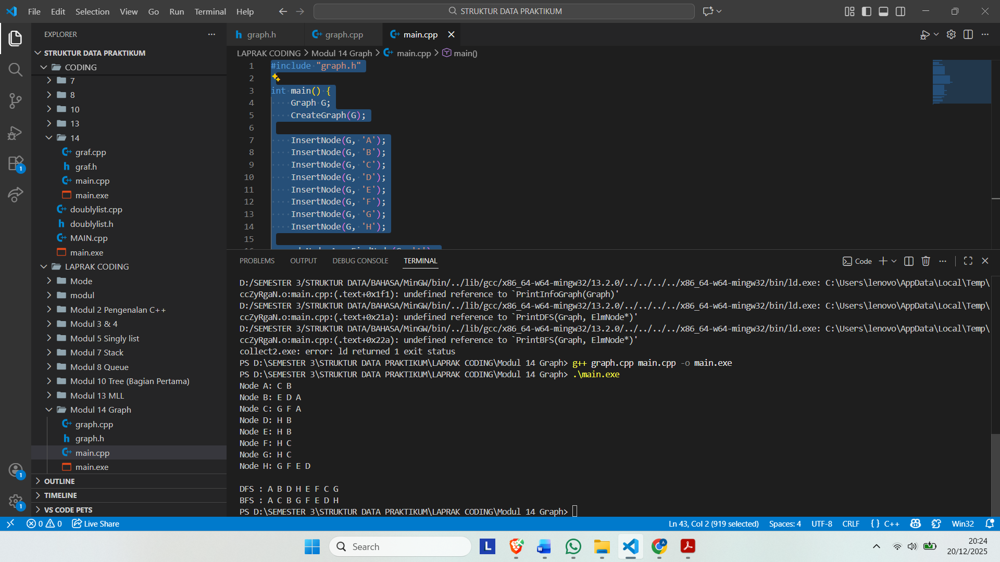

# <h1 align="center">Laporan Praktikum Modul 14 Graph <br> Modul 14 Graph  </h1>
<p align="center">Ajda Mutiara Zahra - 103112400210</p>

## Dasar Teori
Graph merupakan struktur data non-linear yang terdiri dari kumpulan simpul (vertex/node) dan sisi (edge) yang menghubungkan antar simpul tersebut. Setiap simpul merepresentasikan suatu objek, sedangkan sisi menyatakan hubungan atau keterkaitan antara dua simpul. Hubungan dalam graph dapat bersifat berarah maupun tidak berarah, tergantung pada ada atau tidaknya arah pada sisi yang menghubungkannya. Struktur graph banyak digunakan untuk merepresentasikan berbagai permasalahan nyata seperti jaringan jalan, hubungan antar lokasi, alur proses, serta keterkaitan data.

## Guided

### 1. GRAPH
graf.cpp
```
#include "graf.h"
#include <queue>
#include <stack>

void CreateGraph(Graph &G)
{
    G.first = NULL;
}

adrNode AllocateNode(infoGraph X)
{
    adrNode P = new ElmNode;
    P->info = X;
    P->visited = 0;
    P->firstEdge = NULL;
    P->next = NULL;
    return P;
}

adrEdge AllocateEdge(adrNode N)
{
    adrEdge P = new ElmEdge;
    P->node = N;
    P->next = NULL;
    return P;
}

void InsertNode(Graph &G, infoGraph X)
{
    adrNode P = AllocateNode(X);
    P->next = G.first;
    G.first = P;
}

adrNode FindNode(Graph G, infoGraph X)
{
    adrNode P = G.first;
    while (P != NULL)
    {
        if (P->info == X)
            return P;
        P = P->next;
    }
    return NULL;
}

void ConnectNode(Graph &G, infoGraph A, infoGraph B)
{
    adrNode N1 = FindNode(G, A);
    adrNode N2 = FindNode(G, B);

    if (N1 == NULL || N2 == NULL)
    {
        cout << "Node tidak ditemukan!\n";
        return;
    }

    // Buat edge dari N1 ke N2
    adrEdge E1 = AllocateEdge(N2);
    E1->next = N1->firstEdge;
    N1->firstEdge = E1;

    // Karena undirected → buat edge balik
    adrEdge E2 = AllocateEdge(N1);
    E2->next = N2->firstEdge;
    N2->firstEdge = E2;
}

void PrintInfoGraph(Graph G)
{
    adrNode P = G.first;
    while (P != NULL)
    {
        cout << P->info << " -> ";
        adrEdge E = P->firstEdge;
        while (E != NULL)
        {
            cout << E->node->info << " ";
            E = E->next;
        }
        cout << endl;
        P = P->next;
    }
}

void ResetVisited(Graph &G)
{
    adrNode P = G.first;
    while (P != NULL)
    {
        P->visited = 0;
        P = P->next;
    }
}

void PrintDFS(Graph &G, adrNode N)
{
    if (N == NULL)
        return;

    N->visited = 1;
    cout << N->info << " ";

    adrEdge E = N->firstEdge;
    while (E != NULL)
    {
        if (E->node->visited == 0)
        {
            PrintDFS(G, E->node);
        }
        E = E->next;
    }
}

void PrintBFS(Graph &G, adrNode N)
{
    if (N == NULL)
        return;

    queue<adrNode> Q;
    Q.push(N);

    while (!Q.empty())
    {
        adrNode curr = Q.front();
        Q.pop();

        if (curr->visited == 0)
        {
            curr->visited = 1;
            cout << curr->info << " ";

            adrEdge E = curr->firstEdge;
            while (E != NULL)
            {
                if (E->node->visited == 0)
                {
                    Q.push(E->node);
                }
                E = E->next;
            }
        }
    }
}

```

graf.h
```
#ifndef GRAF_H_INCLUDED
#define GRAF_H_INCLUDED

#include <iostream>
using namespace std;

typedef char infoGraph;

struct ElmNode;
struct ElmEdge;

typedef ElmNode *adrNode;
typedef ElmEdge *adrEdge;

struct ElmNode
{
    infoGraph info;
    int visited;
    adrEdge firstEdge;
    adrNode next;
};

struct ElmEdge
{
    adrNode node;
    adrEdge next;
};

struct Graph
{
    adrNode first;
};

// PRIMITIF GRAPH
void CreateGraph(Graph &G);
adrNode AllocateNode(infoGraph X);
adrEdge AllocateEdge(adrNode N);

void InsertNode(Graph &G, infoGraph X);
adrNode FindNode(Graph G, infoGraph X);

void ConnectNode(Graph &G, infoGraph A, infoGraph B);

void PrintInfoGraph(Graph G);

// Traversal
void ResetVisited(Graph &G);
void PrintDFS(Graph &G, adrNode N);
void PrintBFS(Graph &G, adrNode N);

#endif

```

main.cpp
```
#include "graf.h"
#include "graf.cpp"
#include <iostream>
using namespace std;

int main()
{
    Graph G;
    CreateGraph(G);

    // Tambah node
    InsertNode(G, 'A');
    InsertNode(G, 'B');
    InsertNode(G, 'C');
    InsertNode(G, 'D');
    InsertNode(G, 'E');

    // Hubungkan node (graph tidak berarah)
    ConnectNode(G, 'A', 'B');
    ConnectNode(G, 'A', 'C');
    ConnectNode(G, 'B', 'D');
    ConnectNode(G, 'C', 'E');

    cout << "=== Struktur Graph ===\n";
    PrintInfoGraph(G);

    cout << "\n=== DFS dari Node A ===\n";
    ResetVisited(G);
    PrintDFS(G, FindNode(G, 'A'));

    cout << "\n\n=== BFS dari Node A ===\n";
    ResetVisited(G);
    PrintBFS(G, FindNode(G, 'A'));

    cout << endl;
    return 0;
}

```

Penjelasan Program :
Program di atas merupakan program yang digunakan untuk mengimplementasikan struktur data graph dengan memanfaatkan multi linked list sebagai representasi hubungan antar simpul. Program ini memungkinkan pembuatan graph dengan menambahkan node serta menghubungkan node satu dengan node lainnya melalui edge, sehingga dapat merepresentasikan keterkaitan antar data secara dinamis. Selain itu, program juga menyediakan proses penelusuran graph untuk menampilkan informasi simpul yang saling terhubung, sehingga membantu dalam memahami struktur dan hubungan data pada graph.

## Unguided

### Soal 1
. Buatlah ADT Graph tidak berarah file “graph.h”:
Type infoGraph: char
Type adrNode : pointer to ElmNode
Type adrEdge : pointer to ElmNode
Type ElmNode <
info : infoGraph
visited : integer
firstEdge : adrEdge
Next : adrNode
>
Type ElmEdge <
Node : adrNode
Next : adrEdge
>
Type Graph <
first : adrNode
>
procedure CreateGraph (input/output G : Graph)
procedure InsertNode (input/output G : Graph,
 input X : infotype)
procedure ConnectNode (input/output N1, N2 : adrNode)
procedure PrintInfoGraph (input G : Graph)
Program 4 Graph.h
Buatlah implementasi ADT Graph pada file “graph.cpp” dan cobalah hasil implementasi ADT
pada file “main.cpp”.

### soal 2
Buatlah prosedur untuk menampilkanhasil penelusuran DFS.
STRUKTUR DATA 111
prosedur PrintDFS (Graph G, adrNode N);

### soal 3
Buatlah prosedur untuk menampilkanhasil penelusuran DFS.
prosedur PrintBFS (Graph G, adrNode N);

graph.h
```
#ifndef GRAPH_H
#define GRAPH_H

#include <iostream>
using namespace std;

typedef char infoGraph;
typedef struct ElmNode *adrNode;
typedef struct ElmEdge *adrEdge;

struct ElmNode {
    infoGraph info;
    int visited;
    adrEdge firstEdge;
    adrNode Next;
};

struct ElmEdge {
    adrNode Node;
    adrEdge Next;
};

struct Graph {
    adrNode first;
};

void CreateGraph(Graph &G);
adrNode AlokNode(infoGraph X);
void InsertNode(Graph &G, infoGraph X);
void ConnectNode(adrNode N1, adrNode N2);
void PrintInfoGraph(Graph G);

void ResetVisited(Graph &G);
void PrintDFS(Graph G, adrNode N);
void PrintBFS(Graph G, adrNode N);

adrNode FindNode(Graph G, infoGraph X);

#endif
```

graph.cpp
```
#include "graph.h"
#include <stack>
#include <queue>

void CreateGraph(Graph &G) {
    G.first = NULL;
}

adrNode AlokNode(infoGraph X) {
    adrNode P = new ElmNode;
    P->info = X;
    P->visited = 0;
    P->firstEdge = NULL;
    P->Next = NULL;
    return P;
}

void InsertNode(Graph &G, infoGraph X) {
    adrNode P = AlokNode(X);
    if (G.first == NULL) {
        G.first = P;
    } else {
        adrNode last = G.first;
        while (last->Next != NULL) {
            last = last->Next;
        }
        last->Next = P;
    }
}

void ConnectNode(adrNode N1, adrNode N2) {
    if (N1 != NULL && N2 != NULL) {
        adrEdge E1 = new ElmEdge;
        E1->Node = N2;
        E1->Next = N1->firstEdge;
        N1->firstEdge = E1;

        adrEdge E2 = new ElmEdge;
        E2->Node = N1;
        E2->Next = N2->firstEdge;
        N2->firstEdge = E2;
    }
}

void PrintInfoGraph(Graph G) {
    adrNode P = G.first;
    while (P != NULL) {
        cout << "Node " << P->info << ": ";
        adrEdge E = P->firstEdge;
        while (E != NULL) {
            cout << E->Node->info << " ";
            E = E->Next;
        }
        cout << endl;
        P = P->Next;
    }
}

adrNode FindNode(Graph G, infoGraph X) {
    adrNode P = G.first;
    while (P != NULL) {
        if (P->info == X) {
            return P;
        }
        P = P->Next;
    }
    return NULL;
}

void ResetVisited(Graph &G) {
    adrNode P = G.first;
    while (P != NULL) {
        P->visited = 0;
        P = P->Next;
    }
}

void PrintDFS(Graph G, adrNode N) {
    ResetVisited(G);
    stack<adrNode> S;
    S.push(N);
    
    cout << "DFS : ";
    while (!S.empty()) {
        adrNode curr = S.top();
        S.pop();
        
        if (curr->visited == 0) {
            curr->visited = 1;
            cout << curr->info << " ";
            
            adrEdge E = curr->firstEdge;
            while (E != NULL) {
                if (E->Node->visited == 0) {
                    S.push(E->Node);
                }
                E = E->Next;
            }
        }
    }
    cout << endl;
}

void PrintBFS(Graph G, adrNode N) {
    ResetVisited(G);
    queue<adrNode> Q;
    Q.push(N);
    N->visited = 1;
    
    cout << "BFS : ";
    while (!Q.empty()) {
        adrNode curr = Q.front();
        Q.pop();
        cout << curr->info << " ";
        
        adrEdge E = curr->firstEdge;
        while (E != NULL) {
            if (E->Node->visited == 0) {
                E->Node->visited = 1;
                Q.push(E->Node);
            }
            E = E->Next;
        }
    }
    cout << endl;
}
```

main.cpp
```
#include "graph.h"

int main() {
    Graph G;
    CreateGraph(G);

    InsertNode(G, 'A');
    InsertNode(G, 'B');
    InsertNode(G, 'C');
    InsertNode(G, 'D');
    InsertNode(G, 'E');
    InsertNode(G, 'F');
    InsertNode(G, 'G');
    InsertNode(G, 'H');

    adrNode A = FindNode(G, 'A');
    adrNode B = FindNode(G, 'B');
    adrNode C = FindNode(G, 'C');
    adrNode D = FindNode(G, 'D');
    adrNode E = FindNode(G, 'E');
    adrNode F = FindNode(G, 'F');
    adrNode G_node = FindNode(G, 'G');
    adrNode H = FindNode(G, 'H');

    ConnectNode(A, B);
    ConnectNode(A, C);
    ConnectNode(B, D);
    ConnectNode(B, E);
    ConnectNode(C, F);
    ConnectNode(C, G_node);
    ConnectNode(D, H);
    ConnectNode(E, H);
    ConnectNode(F, H);
    ConnectNode(G_node, H);

    PrintInfoGraph(G);
    cout << endl;

    PrintDFS(G, A);
    PrintBFS(G, A);

    return 0;
}
```
> Output
> 


Soal 1 
Program di atas digunakan untuk membentuk struktur dasar graph dengan mendefinisikan simpul (vertex) yang merepresentasikan data ticket. Pada bagian ini, program menyediakan fungsi untuk membuat dan menyimpan node ke dalam graph secara dinamis, sehingga setiap ticket dapat direpresentasikan sebagai sebuah simpul.

Soal 2
Program di atas digunakan untuk membangun hubungan antar simpul dalam graph dengan menambahkan sisi (edge) antar data ticket. Program menghubungkan satu simpul dengan simpul lainnya sesuai relasi yang ditentukan, sehingga terbentuk keterkaitan antar ticket. Proses ini menunjukkan penerapan konsep graph berarah atau tidak berarah sesuai kebutuhan, di mana satu ticket dapat memiliki hubungan dengan lebih dari satu ticket lainnya.

Soal 3
Program di atas digunakan untuk menampilkan dan menelusuri graph yang telah terbentuk. Program menampilkan data setiap ticket beserta hubungan antar simpul yang terhubung, sehingga struktur graph dapat diamati secara keseluruhan.


## Referensi

1. https://en.wikipedia.org/wiki/Data_structure
2. http://www.ijcs.net/ijcs/index.php/ijcs/article/view/4650
3. https://teknosi.fti.unand.ac.id/index.php/teknosi/article/view/990
