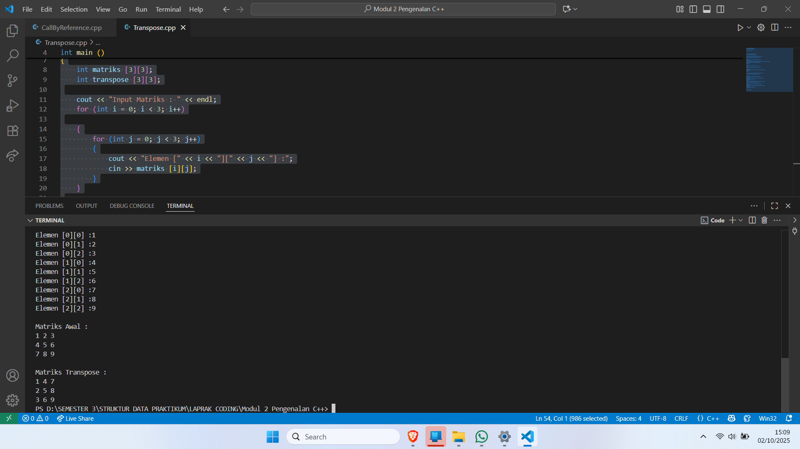
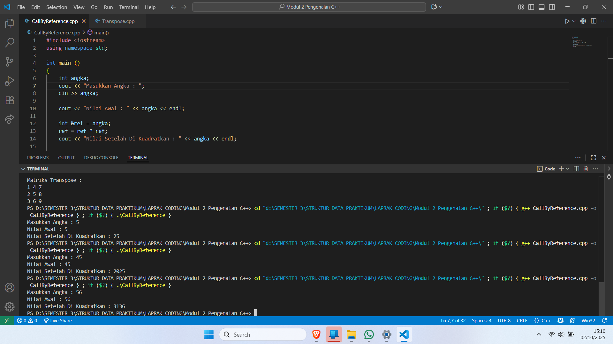

# <h1 align="center">Laporan Praktikum Modul 1 <br> Modul 1 Pengenalan Bahasa C++ (Bagian Dua) </h1>
<p align="center">Ajda Mutiara Zahra - 103112400210</p>

## Dasar Teori
Array adalah kumpulan data dengan tipe yang sama yang disimpan dalam satu variabel, sehingga memudahkan pengolahan data yang jumlahnya banyak. Matriks adalah bentuk lanjutan dari array, di mana data disusun dalam baris dan kolom layaknya tabel, dan bisa dipakai untuk berbagai operasi matematika, misalnya transpose. Pointer adalah variabel khusus yang menyimpan alamat memori dari variabel lain, sehingga kita bisa mengakses atau mengubah data secara langsung lewat alamat tersebut. Sedangkan call by reference adalah cara agar sebuah variabel bisa diproses lewat alamatnya, sehingga perubahan yang dilakukan di dalam fungsi atau blok program akan langsung memengaruhi nilai variabel aslinya.

## Guided

### 1. Aritmatika
```
#include <iostream>
using namespace std;
int main()
{
    int W, X, Y;
    float Z;
    X = 7;
    Y = 3;
    W = 1;
    Z = (X + Y) / (Y + W);
    cout << "Nilai z = " << Z << endl;
    return 0;
}
```
Penjelasan Program :
Program di atas untuk melakukan perhitungan aritmatika sederhana, yaitu menjumlahkan dua bilangan lalu membaginya dengan hasil penjumlahan bilangan lain, kemudian menampilkan hasil akhirnya ke layar.

### 2. Fungsi 
```
#include <iostream>
using namespace std;

// Prosedur: hanya menampilkan hasil, tidak mengembalikan nilai
void tampilkanHasil(double p, double l)
{
    cout << "\n=== Hasil Perhitungan ===" << endl;
    cout << "Panjang : " << p << endl;
    cout << "Lebar   : " << l << endl;
    cout << "Luas    : " << p * l << endl;
    cout << "Keliling: " << 2 * (p + l) << endl;
}

// Fungsi: mengembalikan nilai luas
double hitungLuas(double p, double l)
{
    return p * l;
}

// Fungsi: mengembalikan nilai keliling
double hitungKeliling(double p, double l)
{
    return 2 * (p + l);
}

int main()
{
    double panjang, lebar;

    cout << "Masukkan panjang: ";
    cin >> panjang;
    cout << "Masukkan lebar  : ";
    cin >> lebar;

    // Panggil fungsi
    double luas = hitungLuas(panjang, lebar);
    double keliling = hitungKeliling(panjang, lebar);

    cout << "\nDihitung dengan fungsi:" << endl;
    cout << "Luas      = " << luas << endl;
    cout << "Keliling  = " << keliling << endl;

    // Panggil prosedur
    tampilkanHasil(panjang, lebar);

    return 0;
}

```

Penjelasan Program :
Program di atas untuk menghitung luas dan keliling persegi panjang dengan menggunakan konsep fungsi dan prosedur, lalu menampilkan hasil perhitungannya kepada pengguna.

### 3. Kondisi
```
#include <iostream>
using namespace std;
// int main()
// {
//     double tot_pembelian, diskon;
//     cout << "total pembelian: Rp";
//     cin >> tot_pembelian;
//     diskon = 0;
//     if (tot_pembelian >= 100000)
//         diskon = 0.05 * tot_pembelian;
//     cout << "besar diskon = Rp" << diskon;
// }


// int main()
// {
//     double tot_pembelian, diskon;
//     cout << "total pembelian: Rp";
//     cin >> tot_pembelian;
//     diskon = 0;
//     if (tot_pembelian >= 100000)
//         diskon = 0.05 * tot_pembelian;
//     else
//         diskon = 0;
//     cout << "besar diskon = Rp" << diskon;
// }


int main()
{
    int kode_hari;
    cout << "Menentukan hari kerja/libur\n"<<endl;
    cout << "1=Senin 3=Rabu 5=Jumat 7=Minggu "<<endl;
    cout << "2=Selasa 4=Kamis 6=Sabtu "<<endl;
    cin >> kode_hari;
    switch (kode_hari)
    {
    case 1:
    case 2:
    case 3:
    case 4:
    case 5:
        cout<<"Hari Kerja";
        break;
    case 6:
    case 7:
        cout<<"Hari Libur";
        break;
    default:
        cout<<"Kode masukan salah!!!";
    }
    return 0;
}
```

Penjelasan Program :
Program di atas untuk menentukan hasil berdasarkan kondisi tertentu, misalnya apakah mendapat diskon dari total belanja atau menentukan apakah suatu hari termasuk hari kerja atau hari libur.

### 4. Perulangan

```
#include <iostream>
using namespace std;
// int main()
// {
//     int jum;
//     cout << "jumlah perulangan: ";
//     cin >> jum;
//     for (int i = 0; i < jum; i++)
//     {
//         cout << "saya sahroni\n";
//     }
//     return 1;
// }


// while
int main()
{
    int i = 1;
    int jum;
    cin >> jum;
    do
    {
        cout << "bahlil ke-" << (i + 1) << endl;
        i++;
    } while (i < jum);
    return 0;
}
```

Penjelasan Program :
Program di atas untuk menampilkan teks secara berulang sesuai jumlah yang diinput pengguna dengan menggunakan perulangan (looping).

### 5. Struct
```
#include <iostream>
#include <string>
using namespace std;

// Definisi struct
struct Mahasiswa {
    string nama;
    string nim;
    float ipk;
};

int main() {

    Mahasiswa mhs1;

    cout << "Masukkan Nama Mahasiswa: ";
    getline(cin, mhs1.nama);
    // cin >> mhs1.nama;
    cout << "Masukkan NIM Mahasiswa : ";
    cin >> mhs1.nim;
    cout << "Masukkan IPK Mahasiswa : ";
    cin >> mhs1.ipk;

    cout << "\n=== Data Mahasiswa ===" << endl;
    cout << "Nama : " << mhs1.nama << endl;
    cout << "NIM  : " << mhs1.nim << endl;
    cout << "IPK  : " << mhs1.ipk << endl;

    return 0;
}
```

Penjelasan Program :
Program di atas untuk menyimpan dan menampilkan data mahasiswa (nama, NIM, dan IPK) menggunakan struktur data struct agar lebih terorganisir.

### 6. Input Karakter
```
#include <iostream>
using namespace std;
int main()
{
    string ch;
    cout << "Masukkan sebuah karakter: ";
    // cin >> ch;
    ch = getchar();  //Menggunakan getchar() untuk membaca satu karakter
    cout << "Karakter yang Anda masukkan adalah: " << ch << endl;
    return 0;
}
```


Penjelasan Program :
Program di atas untuk membaca satu karakter yang dimasukkan pengguna, kemudian menampilkan kembali karakter tersebut di layar.


## Unguided

### Soal 1

Buatlah sebuah program untuk melakukan transpose pada sebuah matriks persegi berukuran 3x3. Operasi transpose adalah mengubah baris menjadi kolom dan sebaliknya. Inisialisasi matriks awal di dalam kode, kemudian buat logika untuk melakukan transpose dan simpan hasilnya ke dalam matriks baru. Terakhir, tampilkan matriks awal dan matriks hasil transpose.

Contoh Output:

Matriks Awal:
1 2 3
4 5 6
7 8 9

Matriks Hasil Transpose:
1 4 7
2 5 8
3 6 9


```
#include <iostream>
using namespace std;

int main ()


{
    int matriks [3][3];
    int transpose [3][3];

    cout << "Input Matriks : " << endl;
    for (int i = 0; i < 3; i++)

    {
        for (int j = 0; j < 3; j++)
        {
            cout << "Elemen [" << i << "][" << j << "] :";
            cin >> matriks [i][j];
        }
    }

    for (int i = 0; i < 3; i++)
    {
        for (int j = 0; j < 3; j++)

        {
            transpose [j][i] = matriks [i][j];
        }
    }

    cout << "\nMatriks Awal : " << endl;
    for (int i = 0; i < 3; i++)

    {
        for (int j = 0; j < 3; j++)
        {
            cout << matriks [i][j] << " ";
        }
        cout << endl;
    }
    cout << "\nMatriks Transpose : " << endl;
    for (int i = 0; i< 3; i++)
    {
        for (int j = 0; j <  3; j++) 
        {
            cout << transpose [i][j] << " ";
        }
        cout << endl;
    }

    return 0;

}
```

> Output
> 

Program di atas untuk menampilkan matriks awal dan hasil transpose. User menginput elemen matriks 3x3, lalu program membuat transpose dengan menukar baris jadi kolom. Setelah itu, program menampilkan matriks asli dan matriks hasil transpose.


### Soal 2

Buatlah program yang menunjukkan penggunaan call by reference. Buat sebuah prosedur bernama kuadratkan yang menerima satu parameter integer secara referensi (&). Prosedur ini akan mengubah nilai asli variabel yang dilewatkan dengan nilai kuadratnya. Tampilkan nilai variabel di main() sebelum dan sesudah memanggil prosedur untuk membuktikan perubahannya. 

Contoh Output:

Nilai awal: 5
Nilai setelah dikuadratkan: 25


```
#include <iostream>
using namespace std; 

int main ()
{
    int angka;
    cout << "Masukkan Angka : ";
    cin >> angka;

    cout << "Nilai Awal : " << angka << endl;

    int &ref = angka;
    ref = ref * ref;
    cout << "Nilai Setelah Di Kuadratkan : " << angka << endl;

    return 0;
}
```

> Output
> 

Program di atas untuk mengkuadratkan angka dengan reference. Pertama user memasukkan angka, lalu ditampilkan nilainya. Reference `ref` menunjuk ke variabel `angka`, jadi saat `ref` dikalikan dengan dirinya sendiri, nilai `angka` ikut berubah. Terakhir program menampilkan hasil angka setelah dikuadratkan.


## Referensi

1. https://en.wikipedia.org/wiki/Data_structure
2. https://osf.io/preprints/vyech/
3. https://repository.penerbitwidina.com/media/publications/557434-algoritma-dan-struktur-data-39398749.pdf
